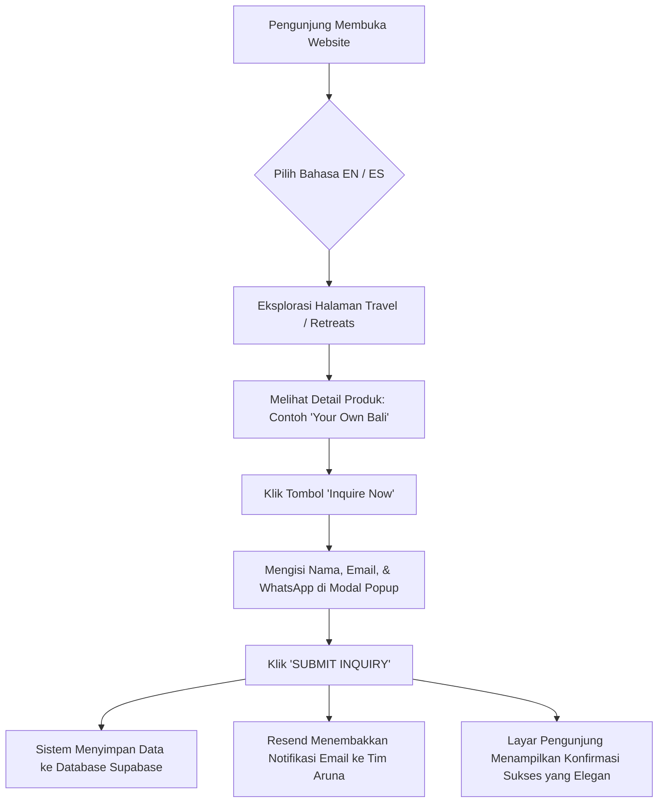

# 📖 Buku Panduan Sistem & Pengelolaan Dashboard Aruna Travel Studio
**Dokumen:** Panduan Operasional Resmi (Official Client User Manual & System Guide)  
**Platform:** Aruna Travel Studio (`arunatravelstudio.com`)  
**Target Pembaca:** Pemilik Bisnis, Manajer Operasional, & Tim Manajemen Konten Aruna  
**Versi Dokumen:** 1.0 (Production Release)  
**Bahasa Panduan:** Bahasa Indonesia  

---

## 📑 Daftar Isi
1. [Pengantar & Gambaran Umum Sistem Aruna](#1-pengantar--gambaran-umum-sistem-aruna)
2. [Alur Kerja Frontend (Customer Journey)](#2-alur-kerja-frontend-customer-journey)
3. [Panduan Lengkap Dashboard CMS Admin](#3-panduan-lengkap-dashboard-cms-admin)
   - [3.1. Akses & Login Admin](#31-akses--login-admin)
   - [3.2. Struktur Antarmuka & Live Interactive Preview](#32-struktur-antarmuka--live-interactive-preview)
   - [3.3. Menu 1: Pages (Pengelolaan Halaman Utama)](#33-menu-1-pages-pengelolaan-halaman-utama)
   - [3.4. Menu 2: Products (Retreats & Travel Services)](#34-menu-2-products-retreats--travel-services)
   - [3.5. Menu 3: Subscribers & Leads (Kotak Masuk Calon Tamu)](#35-menu-3-subscribers--leads-kotak-masuk-calon-tamu)
   - [3.6. Menu 4: Policies (Legal & Kebijakan Privasi)](#36-menu-4-policies-legal--kebijakan-privasi)
   - [3.7. Menu 5: Information (Identitas Brand, Kontak, & Promo Popup)](#37-menu-5-information-identitas-brand-kontak--promo-popup)
   - [3.8. Menu 6: Localization (Penerjemahan Bahasa Spanyol / ES)](#38-menu-6-localization-penerjemahan-bahasa-spanyol--es)
   - [3.9. Menu 7: Access (Manajemen Akun Admin)](#39-menu-7-access-manajemen-akun-admin)
4. [Alur Notifikasi Email Otomatis (Resend Engine)](#4-alur-notifikasi-email-otomatis-resend-engine)
5. [Standar & Panduan Aset Media (Foto & Logo)](#5-standar--panduan-aset-media-foto--logo)
6. [Pertanyaan yang Sering Diajukan (FAQ Operasional)](#6-pertanyaan-yang-sering-diajukan-faq-operasional)

---

## 1. Pengantar & Gambaran Umum Sistem Aruna

Selamat datang di ekosistem digital **Aruna Travel Studio**. Website ini dirancang khusus untuk memadukan estetika visual mewah (*luxury bespoke travel & mindful retreats*) dengan performa teknologi modern kelas dunia.

### Fondasi Teknologi Utama
* **Frontend Modern (Next.js):** Menghadirkan navigasi yang sangat cepat, transisi halus, dan animasi responsif di semua ukuran layar (Laptop, Tablet, dan Smartphone).
* **Database & Cloud Storage (Supabase):** Menyimpan seluruh data konten website, produk perjalanan, jadwal retret, ulasan tamu, dan basis data calon klien secara aman dengan enkripsi standar industri.
* **Serverless Email Engine (Resend):** Mengirimkan notifikasi instan langsung dari server ke inbox email Anda setiap kali ada calon tamu yang mengirimkan formulir di website.
* **Arsitektur Multi-Bahasa (*Bilingual Ready*):** Mendukung penuh **Bahasa Inggris (EN)** sebagai bahasa internasional utama dan **Bahasa Spanyol (ES)** sebagai bahasa sekunder.

---

## 2. Alur Kerja Frontend (Customer Journey)

Bagian ini menjelaskan bagaimana calon tamu berinteraksi dengan website Aruna dari awal hingga mengirimkan data reservasi.

### 2.1. Navigasi & Pemilihan Bahasa
1. Pengunjung dapat berpindah bahasa kapan saja melalui tombol **EN / ES** di sudut kanan atas navbar.
2. Seluruh URL akan menyesuaikan secara otomatis (misal: `/en/travel` untuk Bahasa Inggris dan `/es/travel` untuk Bahasa Spanyol).

### 2.2. Dua Pilar Layanan Utama
* **Travel Design (`/[lang]/travel`):**  
  Menampilkan layanan kurasi perjalanan kustom (seperti paket *"Your own Bali"*, *"Discover Bali"*, *"Bali Honeymoon"*). Pengunjung dapat melihat narasi personal Jessica Vidal, ulasan tamu, galeri inspirasi, dan mengajukan konsultasi perjalanan.
* **Retreats (`/[lang]/retreats`):**  
  Menampilkan program retret transformasional lengkap dengan tanggal pelaksanaan, lokasi resor, filosofi retret, fasilitator, dan tabel paket harga.

### 2.3. Formulir & Interaksi Pengunjung
Website memiliki beberapa pintu masuk bagi calon tamu untuk menghubungi Aruna:
1. **Modal Inquiry Paket / Layanan:**  
   Tersedia di halaman detail layanan (`/services/[slug]`) dan retret (`/retreats/[slug]`). Pengunjung memasukkan Nama, Email, dan WhatsApp.
2. **Tombol Direct WhatsApp:**  
   Jika tamu ingin berkonsultasi langsung tanpa formulir, tersedia tombol *"Inquire via WhatsApp"* yang langsung membuka chat resmi Aruna dengan teks pembuka otomatis.
3. **Formulir Kontak (`/[lang]/contact`):**  
   Untuk pertanyaan umum, kerja sama media, atau permintaan khusus dari klien korporat/keluarga.
4. **Promo Pop-up & Footer Newsletter:**  
   Menangkap email pengunjung baru untuk membangun daftar komunitas *exclusive travel updates*.
5. **Waiting List Form:**  
   Tersedia pada program retret yang sudah penuh atau belum membuka tanggal resmi, memungkinkan tamu mendaftar antrean prioritas.

---

## 3. Panduan Lengkap Dashboard CMS Admin

Dashboard CMS Aruna adalah pusat komando bagi tim Anda untuk mengubah teks, memperbarui harga, mengganti foto, menambah paket retret baru, dan memantau calon tamu yang masuk.

---

### 3.1. Akses & Login Admin
* **URL Login:** `https://arunatravelstudio.com/dashboard/login`
* **Kebutuhan Perangkat:** **Desktop / Laptop** (Dashboard dirancang khusus untuk layar besar agar Anda dapat melihat tampilan edit sekaligus pratinjau langsung website secara bersamaan).
* **Langkah Masuk:**
  1. Masukkan alamat email admin terdaftar dan kata sandi Anda.
  2. Klik tombol **Sign In**.
  3. Sistem akan memverifikasi sesi keamanan dan mengarahkan Anda ke Editor Dashboard.

---

### 3.2. Struktur Antarmuka & Live Interactive Preview
Layar Dashboard terbagi menjadi dua bagian:
* **Panel Kiri (Sidebar Editor - Lebar 400px):**  
  Berisi menu pengelolaan konten, input teks, tombol unggah gambar, dan pengaturan.
* **Panel Kanan (Live Interactive Preview):**  
  Menampilkan pratinjau halaman website Anda secara *real-time*. Di bagian atas preview terdapat switch ukuran layar:
  - 🖥️ **Desktop:** Tampilan penuh di layar komputer.
  - 📱 **Tablet (768px):** Tampilan pada iPad / tablet.
  - 📲 **Mobile (375px):** Tampilan pada layar smartphone.

---

### 3.3. Menu 1: Pages (Pengelolaan Halaman Utama)
Gunakan menu ini untuk mengubah teks dan foto pada halaman inti website:

1. Klik menu **Pages** di sidebar.
2. Pilih halaman yang ingin diedit:
   * **Home Page:** Banner Hero, teks sambutan, divider image.
   * **Travel Page:** Hero utama, narasi *About Us*, cerita Jessica Vidal, testimoni kategori travel, dan FAQ travel.
   * **Retreats Page:** Hero retret, filosofi *The Experience*, mosaic foto galeri, dan FAQ retret.
3. Ubah kolom yang diinginkan (misal: mengganti kalimat judul hero).
4. Klik tombol hijau **Save Changes** di bagian bawah. Perubahan akan langsung terlihat di panel pratinjau dan aktif di website.

---

### 3.4. Menu 2: Products (Retreats & Travel Services)
Menu ini digunakan untuk mengatur katalog paket retret dan destinasi layanan travel:

#### A. Menambah Produk Baru
1. Klik menu **Products**, lalu klik tombol **+ Add New Product**.
2. Pilih tipe produk:
   * **Retreat:** Untuk program retret berkala dengan jadwal tanggal tertentu.
   * **Service:** Untuk layanan *Travel Design* berkelanjutan (seperti *"Your own Bali"*).
3. Isi informasi produk:
   * **Title:** Nama paket (misal: *Bali Soul & Wellness Retreat*).
   * **Slug:** URL halaman (otomatis dibuat dari judul, misal: `bali-soul-wellness-retreat`).
   * **Description:** Deskripsi singkat untuk kartu depan.
   * **Hero Image:** Foto utama beresolusi tinggi.
4. Pada tipe **Retreat**, lengkapi bagian paket harga:
   * Tambahkan variasi kamar (misal: *Single Occupancy*, *Shared Double*).
   * Masukkan harga dalam USD/EUR.
   * Tentukan tanggal pelaksanaan.
5. Klik **Save Product**.

#### B. Mengubah atau Menghapus Produk
* Klik ikon **Edit (Pensil)** pada produk yang ada untuk memperbarui tanggal, harga, atau fasilitas.
* Klik ikon **Delete (Tempat Sampah)** untuk menghapus paket yang sudah tidak berlaku.

---

### 3.5. Menu 3: Subscribers & Leads (Kotak Masuk Calon Tamu)
Ini adalah basis data prospek bisnis (*customer database*) Aruna:

1. Klik menu **Subscribers**.
2. Anda akan melihat tabel seluruh calon tamu yang telah mengisi formulir di website, lengkap dengan:
   * **Email Tamu:** Alamat email pengunjung.
   * **Source (Sumber):** Asal formulir (*Retreat Inquiry*, *Service Inquiry*, *Contact Form*, atau *Promo Popup*).
   * **Details:** Nama tamu, nomor WhatsApp, paket yang diminati, serta pesan khusus.
   * **Tanggal & Waktu:** Waktu submisi data.
3. **Ekspor Data ke Excel/CSV:**  
   Klik tombol **Export to CSV** di sudut kanan atas untuk mengunduh seluruh data calon tamu ke laptop Anda guna keperluan arsip atau kampanye *newsletter broadcast*.

---

### 3.6. Menu 4: Policies (Legal & Kebijakan Privasi)
Digunakan untuk memperbarui ketentuan hukum website:
* **Legal Terms & Conditions (`/[lang]/legal`)**
* **Privacy Policy (`/[lang]/privacy`)**

Editor dilengkapi dengan *Rich Text Editor* (Wysiwyg), sehingga Anda bisa membuat paragraf, poin-poin (*bullet points*), teks tebal (*bold*), dan link dengan mudah.

---

### 3.7. Menu 5: Information (Identitas Brand, Kontak, & Promo Popup)
Pusat pengaturan identitas global website:

1. **Brand Assets:**
   * **Logo Navbar:** Logo terang untuk navigasi transparan.
   * **Logo Footer:** Logo untuk bagian bawah website.
2. **Kontak Resmi:**
   * **Nomor WhatsApp:** Masukkan nomor WhatsApp resmi tim Anda. Sistem memiliki auto-sanitasi sehingga nomor akan otomatis terhubung ke link chat yang benar.
   * **Email Kontak:** Email yang ditampilkan di footer (misal: `hello@arunatravelstudio.com`).
   * **Nomor Telepon:** Telepon kantor yang bisa langsung ditelepon saat diklik di smartphone.
3. **Tautan Media Sosial:**
   * Masukkan link profil resmi: **Instagram**, **TikTok**, **Facebook**, dan **WhatsApp**. Jika salah satu dikosongkan, ikon tersebut akan otomatis disembunyikan agar tampilan tetap rapi.
4. **Pengaturan Promo Pop-up:**
   * **Enabled:** Centang untuk mengaktifkan pop-up penawaran atau hilangkan centang untuk mematikan pop-up promo sementara.
   * **Title & Description:** Kalimat penawaran promo (misal: *"Join our community for 10% off your first trip"*).

---

### 3.8. Menu 6: Localization (Penerjemahan Bahasa Spanyol / ES)
Aruna memiliki target audiens internasional dan penutur Bahasa Spanyol:

1. Klik menu **Localization**.
2. Pilih halaman yang ingin diterjemahkan (Home, Travel, Retreats, atau Navigation).
3. Anda akan melihat teks asli Bahasa Inggris di sisi kiri dan kolom Bahasa Spanyol di sisi kanan.
4. Masukkan teks terjemahan Bahasa Spanyol yang sesuai.
5. Klik **Save Translations**. Pengunjung yang memilih bahasa **ES** di website akan langsung melihat konten dalam Bahasa Spanyol.

---

### 3.9. Menu 7: Access (Manajemen Akun Admin)
Digunakan untuk mengelola siapa saja yang berhak mengakses dashboard CMS:
* **Melihat Daftar Admin:** Menampilkan seluruh alamat email yang memiliki hak akses.
* **Menambah Admin Baru:** Masukkan email staf atau rekan bisnis Anda, lalu tentukan kata sandi awal.
* **Menghapus Akses:** Klik ikon hapus di samping email staf yang sudah tidak bertugas untuk mencabut hak akses secara instan.

---

## 4. Alur Notifikasi Email Otomatis (Resend Engine)

Setiap kali ada aktivitas calon klien di website, sistem serverless Aruna akan mengirimkan email pemberitahuan ke inbox **`arunatravelstudio@gmail.com`** *(atau email domain resmi Anda)*.

### 4 Jenis Email yang Akan Anda Terima:
1. **🛎️ [New Inquiry] `{Nama Retret/Service}` - `{Nama Tamu}`:**  
   Berisi rincian lengkap inquiry paket liburan, nama tamu, email, nomor WhatsApp, serta pilihan paket yang diminta.
2. **✉️ [Contact Form] `{Subject}` - `{Nama Pengirim}`:**  
   Berisi pesan pertanyaan dari halaman Hubungi Kami.
3. **💌 [New Subscriber] `{Email}` via `{Promo Popup / Footer}`:**  
   Pemberitahuan bahwa ada audiens baru yang mendaftar ke komunitas Aruna.
4. **📋 [Waiting List] `{Nama Retret}` - `{Email Tamu}`:**  
   Pemberitahuan bahwa ada tamu yang mengantre untuk program retret mendatang.

### Cara Merespon Cepat (1-Click Action)
Di dalam setiap email notifikasi yang Anda terima di Gmail, terdapat dua tombol praktis:
* **Tombol Hijau ("Chat on WhatsApp"):**  
  Mengklik tombol ini akan langsung membuka aplikasi WhatsApp di laptop/HP Anda menuju nomor calon tamu tersebut tanpa perlu menyimpan kontaknya terlebih dahulu.
* **Tombol Cokelat ("Reply via Email"):**  
  Membuka draf balasan email resmi langsung ke alamat email calon tamu.

---

## 5. Standar & Panduan Aset Media (Foto & Logo)

Kualitas visual adalah jiwa dari Aruna Travel Studio. Agar website tetap terlihat elegan, berkelas, dan memuat dengan cepat, ikuti panduan berikut saat mengunggah foto baru di dashboard:

### Rekomendasi Dimensi & Format Gambar:
| Bagian Website | Rekomendasi Ukuran (Pixels) | Rasio Aspek | Format Terbaik |
| :--- | :--- | :---: | :---: |
| **Hero Banner (Utama)** | 1920 x 1080 px | 16:9 Landscape | WebP / JPG |
| **Foto Produk / Retret** | 1200 x 800 px | 3:2 Landscape | WebP / JPG |
| **Galeri / Mosaic** | 800 x 800 px atau 800 x 1000 px | 1:1 atau 4:5 Portrait | WebP / JPG |
| **Logo Brand** | Lebar min. 500 px (Background Transparan) | Bebas | PNG / WebP |

### Tips Penting Unggah Gambar:
1. **Sistem Kompresi Otomatis:** Dashboard Aruna telah dilengkapi teknologi kompresi cerdas. Foto berukuran besar dari kamera (5 MB – 10 MB) akan otomatis dioptimasi agar website tidak lemot saat dibuka tamu.
2. **Pencahayaan & Nuansa Warna:** Gunakan foto bernuansa hangat, alami (*earthy tones*), dan tenang sesuai estetika ketenangan pulau Bali.

---

## 6. Pertanyaan yang Sering Diajukan (FAQ Operasional)

#### Q1: Berapa lama waktu yang dibutuhkan sampai perubahan di Dashboard muncul di website publik?
> **Jawab:** **Seketika (Instant).** Sistem CMS Aruna menggunakan teknologi *On-Demand Revalidation*. Begitu Anda menekan tombol *Save*, server akan langsung memperbarui halaman publik dalam hitungan detik.

#### Q2: Mengapa dashboard tidak bisa dibuka di smartphone saya?
> **Jawab:** Dashboard CMS sengaja dikunci untuk perangkat komputer (*Desktop Only*). Hal ini dirancang untuk menjaga kenyamanan Anda saat menyunting konten panjang, mengunggah foto beresolusi tinggi, dan melihat pratinjau website secara berdampingan.

#### Q3: Jika calon tamu mengklik 'Submit Inquiry' tapi internet mereka lambat, apakah datanya hilang?
> **Jawab:** **Tidak.** Sistem akan memprioritaskan penyimpanan data ke database Supabase terlebih dahulu. Begitu data tersimpan, sistem akan menembakkan email notifikasi ke tim Anda.

#### Q4: Bagaimana jika kami ingin mengganti nomor WhatsApp atau akun Instagram?
> **Jawab:** Cukup buka Dashboard CMS > menu **Information**, perbarui nomor WhatsApp atau link Instagram Anda di kolom yang tersedia, lalu klik **Save Changes**. Semua tautan di website akan langsung berganti secara serentak.

---

*Dokumen ini disusun untuk menjamin kelancaran operasional dan pemeliharaan jangka panjang Aruna Travel Studio.*
