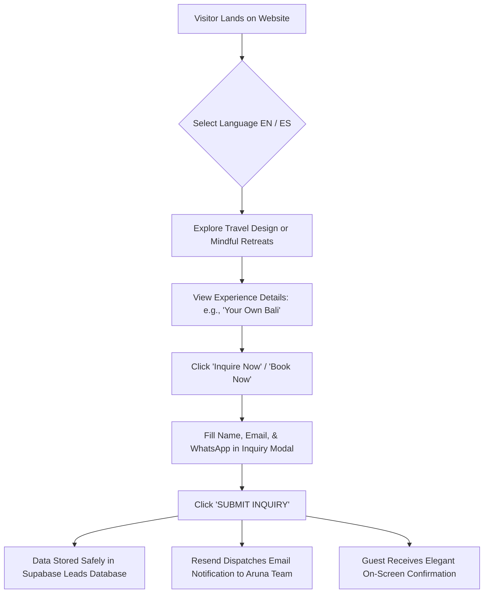

# 📖 Official System & CMS Operations Manual — Aruna Travel Studio
**Document:** Official Client User Manual & Website Operations Guide  
**Platform:** Aruna Travel Studio (`arunatravelstudio.com`)  
**Target Audience:** Business Owners, Operations Managers, & Content Editors (Jessica Vidal & Team)  
**Version:** 1.0 (Production Release)  
**Language:** English (US / International)  

---

## 📑 Table of Contents
1. [Executive Summary & Platform Architecture](#1-executive-summary--platform-architecture)
2. [Frontend Workflows & The Guest Customer Journey](#2-frontend-workflows--the-guest-customer-journey)
3. [Complete Step-by-Step CMS Dashboard Guide](#3-complete-step-by-step-cms-dashboard-guide)
   - [3.1. Admin Access & Login Credentials](#31-admin-access--login-credentials)
   - [3.2. Dashboard Interface & Live Interactive Preview](#32-dashboard-interface--live-interactive-preview)
   - [3.3. Menu 1: Pages (Main Page Content Editor)](#33-menu-1-pages-main-page-content-editor)
   - [3.4. Menu 2: Products (Retreats & Travel Services Hub)](#34-menu-2-products-retreats--travel-services-hub)
   - [3.5. Menu 3: Subscribers & Leads (Prospect & Inquiry Center)](#35-menu-3-subscribers--leads-prospect--inquiry-center)
   - [3.6. Menu 4: Policies (Legal Terms & Privacy Policy)](#36-menu-4-policies-legal-terms--privacy-policy)
   - [3.7. Menu 5: Information (Brand Identity, Contact, & Promo Popup)](#37-menu-5-information-brand-identity-contact--promo-popup)
   - [3.8. Menu 6: Localization (Spanish / ES Translation Hub)](#38-menu-6-localization-spanish--es-translation-hub)
   - [3.9. Menu 7: Access (Admin User & Security Management)](#39-menu-7-access-admin-user--security-management)
4. [Automated Email Notification System (Resend Engine)](#4-automated-email-notification-system-resend-engine)
5. [Media Asset Standards & Upload Guidelines](#5-media-asset-standards--upload-guidelines)
6. [Frequently Asked Questions (FAQ) & Best Practices](#6-frequently-asked-questions-faq--best-practices)

---

## 1. Executive Summary & Platform Architecture

Welcome to the official digital ecosystem of **Aruna Travel Studio**. This bespoke web platform has been engineered to unite luxury visual aesthetics (*bespoke travel design & mindful wellness retreats*) with enterprise-grade web performance and security.

### Core Architectural Pillars
* **Modern Serverless Frontend (Next.js):** Delivers ultra-fast page loads, fluid editorial typography, elegant micro-animations, and responsive layouts tailored for Desktops, Tablets, and Smartphones.
* **Encrypted Cloud Database & Storage (Supabase):** Houses all website copy, product catalogs, retreat dates, guest reviews, and prospective client inquiries in an encrypted, highly reliable cloud database.
* **Automated Transactional Email Engine (Resend):** Instantly dispatches stylized, formatted email alerts directly from the server to your management inbox whenever a prospective guest completes an inquiry or form.
* **Dual-Language Architecture (*Bilingual Ready*):** Fully supports **English (EN)** as the primary international language and **Spanish (ES)** as the secondary language for the European and Latin American markets.
* **Instant On-Demand Content Updates:** When you edit prices, dates, or text in the dashboard, the changes are published live to the global audience in real-time.

---

## 2. Frontend Workflows & The Guest Customer Journey

This section outlines how prospective guests discover, navigate, and book experiences on the Aruna Travel Studio website.

### 2.1. Language Selection & URL Structure
* Guests can toggle between **English (EN)** and **Spanish (ES)** via the clean language switcher located in the top navigation bar.
* All page URLs are cleanly structured and search-engine optimized (e.g., `/en/travel` for English and `/es/travel` for Spanish).

### 2.2. The Two Signature Pillars
* **Travel Design (`/[lang]/travel`):**  
  Presents bespoke, tailor-made Bali travel itineraries (such as *"Your own Bali"*, *"Discover Bali"*, and *"Bali Honeymoon"*). Visitors can explore the personal story of founder Jessica Vidal, read verified guest testimonials, view inspirational photography, and request personalized trip planning.
* **Mindful Retreats (`/[lang]/retreats`):**  
  Showcases transformative retreat programs complete with scheduled dates, resort locations, retreat philosophy (*The Experience*), facilitator highlights, and clear pricing tables.

### 2.3. Guest Touchpoints & Lead Capture
The website provides multiple streamlined channels for prospective clients to connect with Aruna:
1. **Experience Inquiry Modal:**  
   Accessible on every travel service page (`/services/[slug]`) and retreat detail page (`/retreats/[slug]`). Guests submit their Name, Email, and WhatsApp number.
2. **Direct WhatsApp Concierge Button:**  
   For guests who prefer immediate messaging, a 1-click *"Inquire via WhatsApp"* button opens an official WhatsApp chat with pre-filled greeting text.
3. **Contact Page Form (`/[lang]/contact`):**  
   Designed for bespoke private requests, corporate retreats, press inquiries, or special consultations.
4. **Promo Pop-up & Footer Newsletter:**  
   Captures emails from early-stage visitors in exchange for special offers and exclusive retreat announcements.
5. **Waiting List Registration:**  
   Allows guests to register for future retreat dates or join priority queues for sold-out experiences.

---

## 3. Complete Step-by-Step CMS Dashboard Guide

The Aruna CMS Dashboard is your private command center to edit copy, update pricing, add retreat packages, manage media, and monitor prospective client leads.

---

### 3.1. Admin Access & Login Credentials

* **Dashboard URL:** `https://arunatravelstudio.com/dashboard/login`
* **Default Admin Email:** `admin@arunatravelstudio.com`
* **Default Admin Password:** `admin123`
* **Supported Devices:** **Desktop or Laptop Computer** *(The CMS interface requires a desktop screen to provide a comfortable side-by-side editing experience with the live website preview)*.

#### How to Log In:
1. Navigate to `https://arunatravelstudio.com/dashboard/login` on your laptop.
2. Enter your email (`admin@arunatravelstudio.com`) and password (`admin123`).
3. Click **Sign In**. The system will securely verify your session and open the Dashboard Editor.

---

### 3.2. Dashboard Interface & Live Interactive Preview
The dashboard screen is divided into two intuitive working zones:
* **Left Panel (400px Editor Toolbar):**  
  Houses all content categories, text input fields, image uploaders, and settings.
* **Right Panel (Live Interactive Preview):**  
  Displays a real-time live preview of your actual website. At the top of the preview panel, you can switch viewports to verify how your pages look across devices:
  - 🖥️ **Desktop:** Standard widescreen layout.
  - 📱 **Tablet (768px):** iPad and tablet view.
  - 📲 **Mobile (375px):** Smartphone view.

---

### 3.3. Menu 1: Pages (Main Page Content Editor)
Use this menu to edit text, quotes, and background images across the core pages:

1. Click **Pages** in the main sidebar.
2. Select the target page to edit:
   * **Home Page:** Hero headline, introductory subtitle, image dividers.
   * **Travel Page:** Main travel hero, *About Aruna* section, Jessica Vidal's narrative quote, testimonials, and travel FAQs.
   * **Retreats Page:** Retreat hero headline, *The Experience* overview, photo mosaic gallery, and retreat FAQs.
3. Edit the fields as desired (e.g., updating a headline or paragraph).
4. Click the green **Save Changes** button at the bottom. Your updates will immediately appear in the live preview and publish to the live website.

---

### 3.4. Menu 2: Products (Retreats & Travel Services Hub)
Manage your catalog of retreat programs and bespoke travel service packages:

#### A. Adding a New Product
1. Click **Products**, then click **+ Add New Product**.
2. Select the product type:
   * **Retreat:** For date-specific group wellness retreats.
   * **Service:** For ongoing bespoke travel design packages (e.g., *"Your own Bali"*).
3. Complete the essential product details:
   * **Title:** Name of the experience (e.g., *Bali Connection & Transformation Retreat*).
   * **Slug:** URL identifier (auto-generated, e.g., `bali-connection-transformation-retreat`).
   * **Description:** Brief summary displayed on cards and search engines.
   * **Hero Image:** High-resolution cover photograph.
4. For **Retreat** products, configure the pricing & schedule tab:
   * Add room options (e.g., *Single Occupancy Room*, *Shared Twin Room*).
   * Specify package prices in USD / EUR.
   * Set the departure and conclusion dates.
5. Click **Save Product**.

#### B. Editing or Removing Products
* Click the **Edit (Pencil)** icon to update dates, prices, highlights, or inclusions.
* Click the **Delete (Trash)** icon to archive or remove a retired package.

---

### 3.5. Menu 3: Subscribers & Leads (Prospect & Inquiry Center)
View and manage all prospective client inquiries submitted through the website:

1. Click **Subscribers** in the sidebar.
2. The interactive table presents every incoming inquiry with full metadata:
   * **Guest Email:** Client's email address.
   * **Source Channel:** Origin of submission (*Retreat Inquiry*, *Service Inquiry*, *Contact Form*, or *Promo Popup*).
   * **Details:** Guest name, WhatsApp number, requested experience, date selection, and message.
   * **Timestamp:** Exact date and time received.
3. **Exporting Data to Excel / CSV:**  
   Click the **Export to CSV** button in the top-right corner to instantly download your entire lead database to your computer for spreadsheet analysis or email marketing campaigns.

---

### 3.6. Menu 4: Policies (Legal Terms & Privacy Policy)
Update your official legal documents:
* **Legal Terms & Conditions (`/[lang]/legal`)**
* **Privacy Policy (`/[lang]/privacy`)**

The editor features a full Visual Rich Text Editor (Wysiwyg), allowing you to format headings, bullet lists, bold text, and clickable external links effortlessly.

---

### 3.7. Menu 5: Information (Brand Identity, Contact, & Promo Popup)
The central hub for website-wide branding, communication channels, and promotional banners:

1. **Brand Assets:**
   * **Header Logo:** Primary logo displayed on the transparent navigation bar.
   * **Footer Logo:** Logo displayed at the base of every page.
2. **Official Contact Information:**
   * **WhatsApp Number:** Enter your primary business WhatsApp number (e.g., `+62 877 4543 7915`). The platform automatically formats the number into a valid `https://wa.me/` link.
   * **Contact Email:** Official email shown in the footer (`hello@arunatravelstudio.com`).
   * **Phone Number:** Clickable telephone number for direct calling on mobile devices.
3. **Social Media Channels:**
   * Paste URLs for your official profiles: **Instagram**, **TikTok**, **Facebook**, and **WhatsApp**. If a channel is left empty, its icon is cleanly hidden from the public view.
4. **Promo Pop-up Controller:**
   * **Enabled Toggle:** Check to activate the popup banner or uncheck to disable it.
   * **Title & Description:** Promotional messaging (e.g., *"Join our community for 10% off your first journey"*).

---

### 3.8. Menu 6: Localization (Spanish / ES Translation Hub)
Aruna serves a discerning international audience including Spanish-speaking clientele:

1. Click **Localization** in the sidebar.
2. Choose the section you wish to translate (Home, Travel, Retreats, or Navigation).
3. The interface displays the original English copy on the left and the Spanish input fields on the right.
4. Enter your refined Spanish translations.
5. Click **Save Translations**. Visitors selecting **ES** on the website will immediately see the Spanish copy.

---

### 3.9. Menu 7: Access (Admin User & Security Management)
Manage team members who have permission to access the CMS:
* **View Active Admins:** Review all authorized administrative email accounts.
* **Add New Admin:** Enter the email address and initial password for a new team member.
* **Revoke Access:** Click the delete icon next to any account to immediately remove administrative privileges.

---

## 4. Automated Email Notification System (Resend Engine)

Whenever a prospective client engages with a form on the website, the server automatically transmits a formatted notification directly to your team's inbox: **`arunatravelstudio@gmail.com`** *(or your designated domain email)*.

### 4 Formatted Notification Alerts You Will Receive:
1. **🛎️ `[New Inquiry] {Retreat / Service Name} - {Guest Name}`:**  
   Contains complete booking details: guest name, email, WhatsApp number, selected package/dates, and Bali timestamp.
2. **✉️ `[Contact Form] {Subject} - {Sender Name}`:**  
   Contains the guest's contact information and their full inquiry message.
3. **💌 `[New Subscriber] {Email} via {Promo Popup / Footer}`:**  
   Alerts you whenever a new traveler joins the Aruna mailing list.
4. **📋 `[Waiting List] {Experience Name} - {Guest Email}`:**  
   Notifies you that a traveler has requested priority notice for an upcoming retreat.

### Instant 1-Click Response Actions
Inside every notification email you receive in Gmail, two quick-action buttons are built into the design:
* **Green Button ("Chat on WhatsApp"):**  
  Instantly opens WhatsApp on your phone or laptop with a direct chat window to the client's number—no need to manually type or save their contact.
* **Brown Button ("Reply via Email"):**  
  Opens a pre-addressed email response to the client's email address with the inquiry title in the subject line.

---

## 5. Media Asset Standards & Upload Guidelines

Visual storytelling is central to the Aruna Travel Studio brand. To preserve website speed and aesthetic elegance, please follow these asset guidelines:

### Recommended Image Dimensions & Formats:
| Location | Recommended Size (Pixels) | Aspect Ratio | Best Format |
| :--- | :--- | :---: | :---: |
| **Hero Banners (Full Width)** | 1920 x 1080 px | 16:9 Landscape | WebP / JPG |
| **Experience / Retreat Cards** | 1200 x 800 px | 3:2 Landscape | WebP / JPG |
| **Mosaic & Gallery Photos** | 800 x 800 px or 800 x 1000 px | 1:1 Square or 4:5 Portrait | WebP / JPG |
| **Brand Logos** | Width: min. 500 px (Transparent Background) | Free | PNG / WebP |

### Best Practices for Photography:
1. **Automated Compression:** The Aruna CMS incorporates an automatic image optimization engine. Large camera photos (5 MB – 10 MB) are automatically optimized upon upload to ensure fast loading on mobile networks.
2. **Visual Consistency:** Select imagery reflecting warm earth tones, serene natural lighting, lush Balinese landscapes, and authentic moments of calm and transformation.

---

## 6. Frequently Asked Questions (FAQ) & Best Practices

#### Q1: How quickly do changes made in the Dashboard appear on the live website?
> **Answer:** **Instantly.** The Aruna platform utilizes Next.js *On-Demand Cache Revalidation*. The moment you click **Save**, the global cache is purged and updated within seconds.

#### Q2: Why is the CMS Dashboard inaccessible on mobile phones?
> **Answer:** The dashboard is intentionally locked to **Desktop / Laptop devices**. Editing long narrative copy, configuring multi-tiered pricing, uploading photography, and viewing the live side-by-side interactive preview require the screen space of a laptop for accuracy.

#### Q3: If a guest submits an inquiry with a slow internet connection, could the lead be lost?
> **Answer:** **No.** The system architecture guarantees database insertion in Supabase first before initiating email delivery, ensuring no prospective lead is ever lost.

#### Q4: How do I change our official WhatsApp number or Instagram handle across the whole site?
> **Answer:** Simply open the CMS Dashboard > navigate to **Information** > update your WhatsApp number or Instagram link > click **Save Changes**. All links throughout the navigation bar, footer, and inquiry buttons will update simultaneously.

#### Q5: What should I do if I want to update my admin password?
> **Answer:** Open the CMS Dashboard > navigate to **Access** > delete the old admin entry and add your email with the new desired password.

---

*This document is maintained for the ongoing operations, content management, and administrative excellence of Aruna Travel Studio.*
